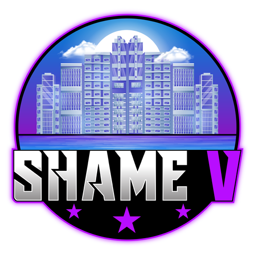

<a name="readme-top"></a>


<!-- PROJECT LOGO -->
<br />
<div align="center">
  <a href="https://github.com/sledgehamm3r/sicherheitsgurt">
    
  </a>

  <h3 align="center">Anschnallscript für FiveM</h3>

  <p align="center">
    Anschnallscript für FiveM mit visueller Warnung sowie Soundeffekten
    <br />
    <a href="https://github.com/sledgehamm3r/sicherheitsgurt"><strong>Dokumentation ansehen »</strong></a>
    <br />
    <br />
    <a href="https://github.com/sledgehamm3r/sicherheitsgurt">Demo</a>
    ·
    <a href="https://github.com/sledgehamm3r/sicherheitsgurt/issues">Bug melden</a>
    ·
    <a href="https://github.com/sledgehamm3r/sicherheitsgurt/issues">Anfrage stellen</a>
  </p>
</div>


<!-- TABLE OF CONTENTS -->
<details>
  <summary>Inhaltsverzeichnis</summary>
  <ol>
    <li>
      <a href="#about-the-project">Über das Projekt</a>
      <ul>
        <li><a href="#built-with">Erstellt mit</a></li>
      </ul>
    </li>
    <li>
      <a href="#getting-started">Verwendung</a>
      <ul>
        <li><a href="#prerequisites">Voraussetzungen</a></li>
        <li><a href="#installation">Installation</a></li>
      </ul>
    </li>
    <li><a href="#usage">Benutzung</a></li>
    <li><a href="#roadmap">Roadmap</a></li>
    <li><a href="#contributing">Contributing</a></li>
    <li><a href="#license">License</a></li>
    <li><a href="#contact">Kontakt</a></li>
    <li><a href="#acknowledgments">Danksagungen</a></li>
  </ol>
</details>


<!-- ABOUT THE PROJECT -->
## Über das Projekt

[![Product Name Screen Shot][product-screenshot]](https://example.com)

Das Realistische Anschnallsystem für FiveM ist ein leistungsstarker Script, der eine immersive Erfahrung in der virtuellen Welt von FiveM bietet. Dieses Script simuliert das Anschnallen und bietet visuelle und akustische Rückmeldungen, um die Spieler daran zu erinnern, wie wichtig es ist, sich im Straßenverkehr sicher zu verhalten.

Funktionen:
* Visuelle Anzeige: Das Script zeigt ein deutlich erkennbares Icon an, das den Spieler darauf hinweist, ob er angeschnallt ist oder nicht. Sobald das Fahrzeug eine Geschwindigkeit von 20 km/h erreicht, wird das Icon sichtbar, um die Spieler an ihre Sicherheit zu erinnern.
* Realistische Unfalldarstellung: Wenn ein Spieler nicht angeschnallt ist und einen Unfall erleidet, wird er aus dem Fahrzeug geschleudert. Dieses Feature vermittelt eine realistische Konsequenz für unverantwortliches Verhalten und fördert so das Bewusstsein für Verkehrssicherheit.
* Akustische Rückmeldung: Durch Drücken der Taste "K" kann sich der Spieler anschnallen oder abschnallen. Beim Betätigen dieser Taste ertönt ein Gurtgeräusch, das den Vorgang des Anschnallens bzw. Abschnallens akustisch begleitet. Dadurch wird die Immersion verstärkt und die Spieler ermutigt, sich aktiv mit dem Anschnallsystem auseinanderzusetzen.
* Config.lua: Der Script hat eine Config.lua, in welcher ihr alles notwenidge ohne große Kenntnisse nach euren Bedürfnissen anpassen könnt!

Das Realistische Anschnallsystem ist speziell für FiveM entwickelt worden und kann nahtlos in deine bestehende Server- oder Client-Ressourcen integriert werden. Es ist einfach zu installieren und zu konfigurieren, und wir haben ausführliche Dokumentationen bereitgestellt, um den Einstieg zu erleichtern.


<p align="right">(<a href="#readme-top">Zurück nach oben</a>)</p>


<!-- GETTING STARTED -->
## Verwendung

Der Script ist einfach zu installieren. Im folgenden Script dennoch eine Erklärung, wie du vorgehen solltest.

### Voraussetzungen

Dies ist ein Script für das ESX-Framwork. Demnach sollte dein Server auf der neuesten ESX Framwork Version laufen.

* Lade den neuesten Release herunter.
  ```sh
  https://github.com/sledgehamm3r/sicherheitsgurt/releases
  ```

### Installation

_Sobald du den Script heruntergeladen hast kommen wir nun zu den weiteren Schritten._

1. Extrahiere den .zip Ordner 
2. Nenne den Ordner, falls notwendig, um. Er sollte ShameV-sicherheitsgurt heißen.
3. Kopiere den Ordner in deinen Ressourcen Ordner.
4. Füge deiner server.cfg folgendes hinzu:
   ```sh
   start ShameV-sicherheitsgurt
   ```

<p align="right">(<a href="#readme-top">Zurück nach Oben</a>)</p>


<!-- USAGE EXAMPLES -->
## Benutzung

Die Benutzung des Scriptes ist sehr einfach. Sobald ein Spieler in einem Fahrzeug sitzt und die Taste "K" drückt, wird er angeschnallt - bei wiederholtem Drücken von "K" wird der Spieler wieder abgeschnallt.

Die config.lua bietet die Möglichkeit verschiedene Paramater zu ändern: 

```sh
-- Anschnallton abspielen Ja/Nein
Config.Sounds = true
Config.LoopSound = false
Config.Volume = 0.8
-- Min: 0.0 Max: 1.0

-- Benachrichtungen An/Aus
Config.Notification = true
Config.Strings = {seatbelt_on = 'Sicherheitsgurt: ~g~angeschnallt', seatbelt_off = 'Sicherheitsgurt: ~r~abgeschnallt'}

-- Warnbild bei nichtanschnallen An/Aus
Config.Blinker = true

-- Taste für den Gurt (docs.fivem.net/docs/game-references/controls)
Config.Control = 311

-- Geschwindigkeit, ab wann man aus dem Auto fällt, wenn man nicht angeschnallt ist.
Config.Speed = 50.0

-- Ab wieviel KM/H soll das Warnbild erscheinen
Config.AlarmOnlySpeed = true
Config.AlarmSpeed = 20
```

<p align="right">(<a href="#readme-top">Zurück nach Oben</a>)</p>


<!-- ROADMAP -->
## Roadmap

- [x] Füge Readme.md hinzu
- [x] Füge Soundeffekte hinzu
- [x] Füge visuelles Warnbild hinzu
- [ ] Füge Multi-language Support hinzu
    - [ ] English


<p align="right">(<a href="#readme-top">Zurück nach Oben</a>)</p>


<!-- CONTRIBUTING -->
## Contributing

Contributions sind es, die die Open-Source-Community zu einem erstaunlichen Ort machen, um zu lernen, sich inspirieren zu lassen und zu kreieren. Jegliche Beiträge, die du leistest, werden sehr geschätzt.

Wenn du eine Verbesserungsidee hast, dann forke bitte das Repository und erstelle einen Pull Request. Du kannst auch einfach ein Issue mit dem Tag "Verbesserung" öffnen.
Vergiss nicht, dem Projekt einen Stern zu geben! Vielen Dank nochmals!

1. Fork das Projekt
2. Erstelle einen Feature Branch (`git checkout -b feature/AmazingFeature`)
3. Commite deine Änderungen (`git commit -m 'Füge eine tolle Funktion hinzu'`)
4. Pushe den Branch (`git push origin feature/AmazingFeature`)
5. Eröffne einen Pull Request

<p align="right">(<a href="#readme-top">Zurück nach Oben</a>)</p>


<!-- LICENSE -->
## License

Veröffentlicht unter der MIT-Lizenz. Weitere Informationen findest du in der Datei `LICENSE.txt`

<p align="right">(<a href="#readme-top">Zurück nach Oben</a>)</p>


<!-- CONTACT -->
## Kontakt

sledgehamm3r - [DISCORD @sledge_hamm3rr] - info@shamev.de

Project Link: [https://github.com/sledgehamm3r/sicherheitsgurt](https://github.com/sledgehamm3r/sicherheitsgurt)

<p align="right">(<a href="#readme-top">Zurück nach Oben</a>)</p>


<!-- MARKDOWN LINKS & IMAGES -->
<!-- https://www.markdownguide.org/basic-syntax/#reference-style-links -->
[contributors-shield]: https://img.shields.io/github/contributors/othneildrew/Best-README-Template.svg?style=for-the-badge
[contributors-url]: https://github.com/othneildrew/Best-README-Template/graphs/contributors
[forks-shield]: https://img.shields.io/github/forks/othneildrew/Best-README-Template.svg?style=for-the-badge
[forks-url]: https://github.com/othneildrew/Best-README-Template/network/members
[stars-shield]: https://img.shields.io/github/stars/othneildrew/Best-README-Template.svg?style=for-the-badge
[stars-url]: https://github.com/othneildrew/Best-README-Template/stargazers
[issues-shield]: https://img.shields.io/github/issues/othneildrew/Best-README-Template.svg?style=for-the-badge
[issues-url]: https://github.com/othneildrew/Best-README-Template/issues
[license-shield]: https://img.shields.io/github/license/othneildrew/Best-README-Template.svg?style=for-the-badge
[license-url]: https://github.com/othneildrew/Best-README-Template/blob/master/LICENSE.txt
[linkedin-shield]: https://img.shields.io/badge/-LinkedIn-black.svg?style=for-the-badge&logo=linkedin&colorB=555
[linkedin-url]: https://linkedin.com/in/othneildrew
[product-screenshot]: images/screenshot.png
[Next.js]: https://img.shields.io/badge/next.js-000000?style=for-the-badge&logo=nextdotjs&logoColor=white
[Next-url]: https://nextjs.org/
[React.js]: https://img.shields.io/badge/HTML-20232A?style=for-the-badge&logo=html&logoColor=61DAFB
[React-url]: https://reactjs.org/
[Vue.js]: https://img.shields.io/badge/Vue.js-35495E?style=for-the-badge&logo=vuedotjs&logoColor=4FC08D
[Vue-url]: https://vuejs.org/
[Angular.io]: https://img.shields.io/badge/Angular-DD0031?style=for-the-badge&logo=angular&logoColor=white
[Angular-url]: https://angular.io/
[Svelte.dev]: https://img.shields.io/badge/Svelte-4A4A55?style=for-the-badge&logo=svelte&logoColor=FF3E00
[Svelte-url]: https://svelte.dev/
[Laravel.com]: https://img.shields.io/badge/Laravel-FF2D20?style=for-the-badge&logo=laravel&logoColor=white
[Laravel-url]: https://laravel.com
[Bootstrap.com]: https://img.shields.io/badge/Bootstrap-563D7C?style=for-the-badge&logo=bootstrap&logoColor=white
[Bootstrap-url]: https://getbootstrap.com
[JQuery.com]: https://img.shields.io/badge/jQuery-0769AD?style=for-the-badge&logo=jquery&logoColor=white
[JQuery-url]: https://jquery.com 
